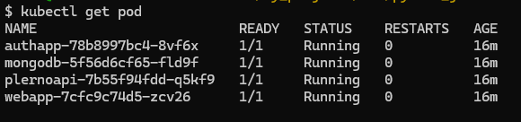
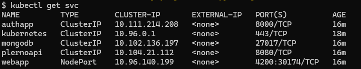
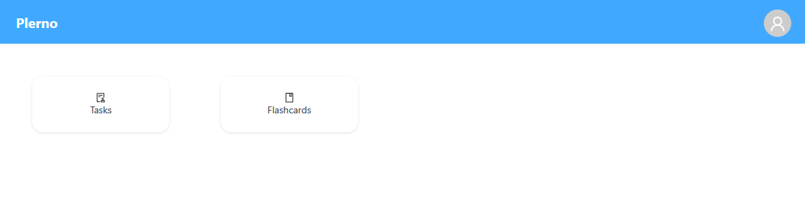
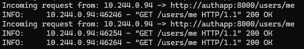

# Plerno

### An app for creating to-do lists and flashcards

#### 🚀 Running the app with Minikube

#### Set up Docker environment
```bash

eval $(minikube docker-env)
```

### Add execute permissions to scripts
```bash

chmod + x build_images.sh
chmod + x build_pods_and_svc.sh
chmod + x clean_minicube.sh
```

### Deploy pods and services

Run the scripts to build and deploy the images.
```bash

sh build_images.sh
sh build_pods_and_svc.sh
```
After successful deployment, your pods and services should look like this:




### Accessing the app
Once deployed, you can run the webapp service with minikube.
```bash

minikube service webapp --url
```


